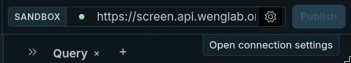
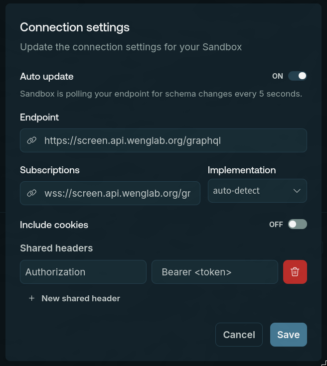

# Authentication

The SCREEN API requires an API key for programmatic access. Send the key in the
`Authorization` header on each request to the GraphQL endpoint.

## Generate an API key

1. Sign in to the API Console.
2. Open the API Keys dashboard.
3. Click `Create API Key`.
4. Copy the generated key and store it securely.

API keys are active for 90 days. If your key expires, create a new one from the
dashboard.

## Use your API key

Include the key as a bearer token:

```text
Authorization: Bearer <token>
```

For example, with `curl`:

```bash
curl 'https://screen.api.wenglab.org/graphql' \
  -H 'Content-Type: application/json' \
  -H 'Accept: application/json' \
  -H 'Authorization: Bearer <token>' \
  --data-binary '{"query":"{ cCREQuery(accession: [\"EH38E1516972\"], assembly: \"grch38\") { coordinates { start end chromosome } rDHS assembly } }"}'
```

Replace `<token>` with the API key from your dashboard.

## Using your API key in Apollo Explorer

To explore this GraphQL service, you can use the [Apollo Explorer](https://studio.apollographql.com/sandbox/explorer), which provides a nice UI to make queries and view documentation.

Add your API key to the request headers by opening the connection settings.

<a href="https://studio.apollographql.com/sandbox/explorer?overlay=connection-settings" rel="noopener noreferrer" target="_blank">
  </img>
</a>

Then add the API key with the `Authorization` header and `Bearer <token>` as the value:

<a href="https://studio.apollographql.com/sandbox/explorer?overlay=connection-settings" rel="noopener noreferrer" target="_blank">
  </img>
</a>
